EN: Color study - for model railways
===========

Goal: create reference material for realistic colors.

Method: RAL color charts provide a cheap reference material for colors. Additionally, all RAL colors have a corresponding sRGB color defined (e.g. [table](https://en.wikipedia.org/wiki/List_of_RAL_colours), [tool](https://rgb.to/ral/page/1)). Using RGB-curves or similar methods, pictures in which RAL color samples are present can be adjusted to match their respective RGB values. Afterwards, a reverse lookup can be used to find the closest matching RAL color for specific features in the image.

Of course this is not a proper color-calibrated method, so the results should only be used as a rough estimate.

NL: Kleurstudie - voor modelbanen
===========

Doel: referentiemateriaal verzamelen voor realistische kleuren.

Werkwijze: RAL-kleurenwaaiers zijn een goedkoop referentiemateriaal voor kleuren. Bovendien is voor alle RAL-kleuren een overeenkomstige sRGB-kleur gedefinieerd (bijv. [tabel](https://en.wikipedia.org/wiki/List_of_RAL_colours), [tool](https://rgb.to/ral/page/1) ). Met behulp van RGB-curven of vergelijkbare methoden kunnen afbeeldingen waarin RAL-kleurmonsters aanwezig zijn, worden aangepast zodat ze overeenkomen met hun respectieve RGB-waarden. Daarna kan omgekeerd worden gezocht naar de dichtstbijzijnde overeenkomende RAL-kleur voor specifieke kenmerken in de afbeelding.

Natuurlijk is dit geen perfecte kleur-gekalibreerde methode, dus de resultaten moeten alleen als ruwe indicatie worden gebruikt.

General notes
=============

The RAL color palette is still rather limited. Especially for nuances such as grass colors, sRGB may be more expressive, while still allowing the use of RAL swatches as calibration targets.

Track
=====
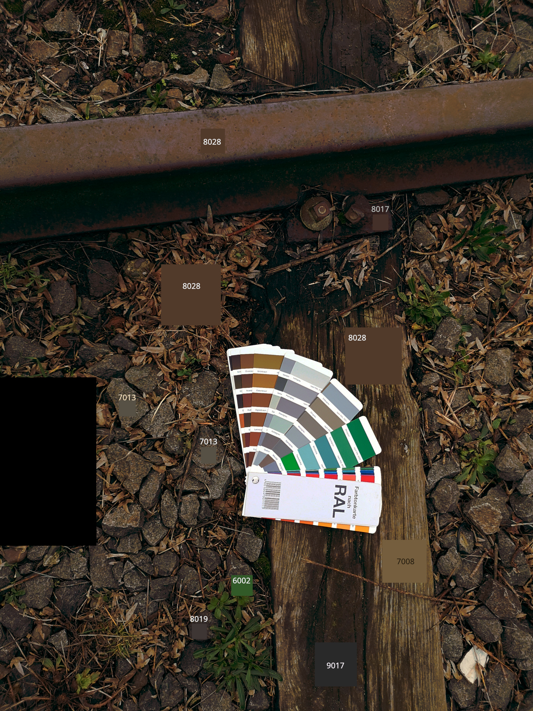

Greenery
========
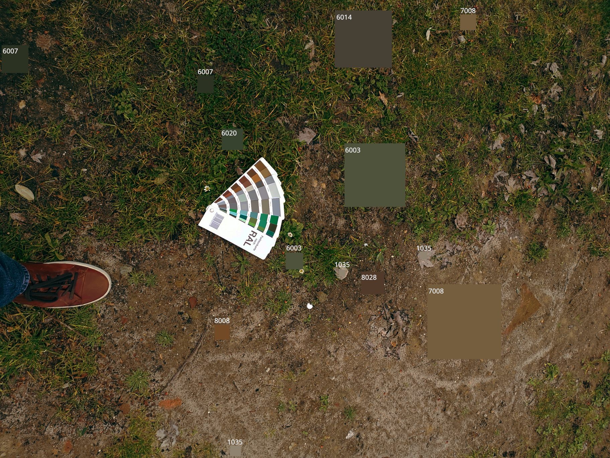

Buildings
=================
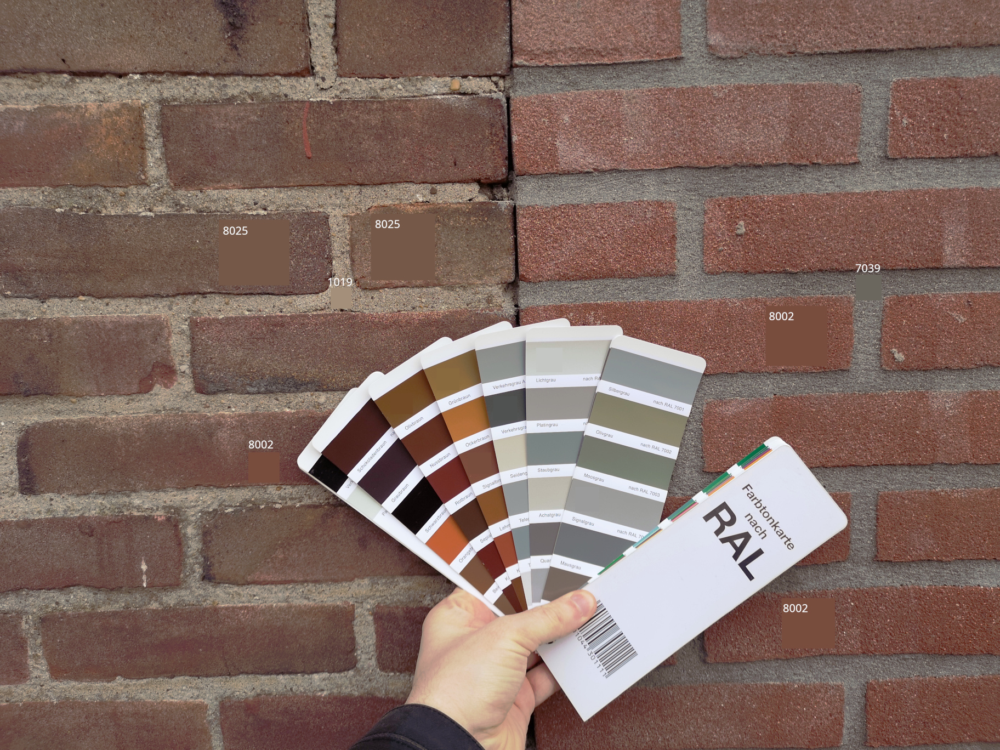

Color systems
=============

Ballast
-------

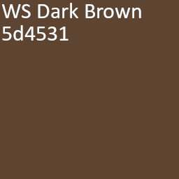 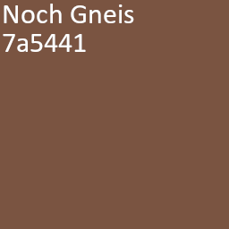
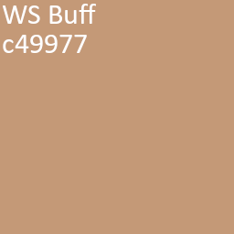 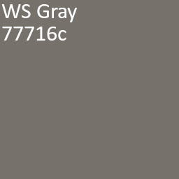 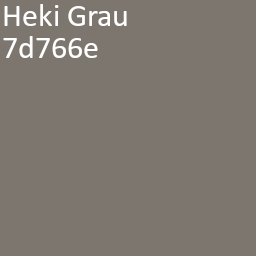 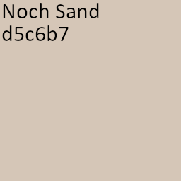 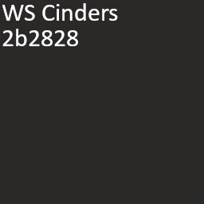

Reference images
----------------

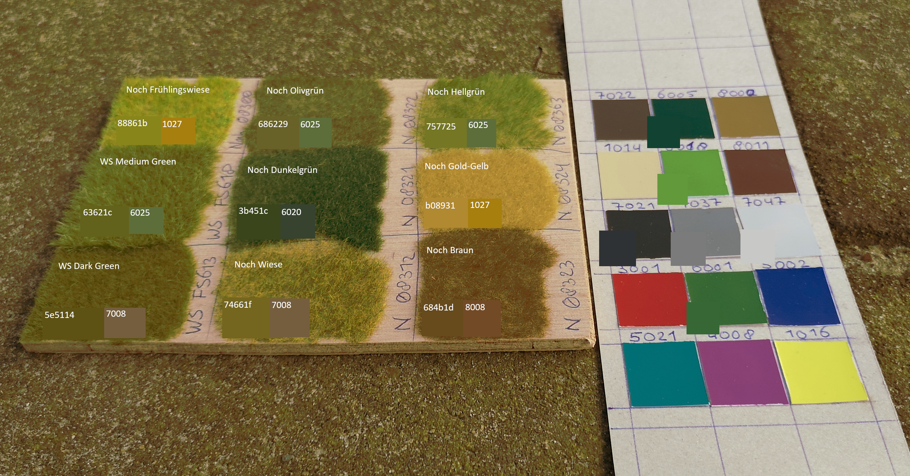
*Image appears exceptionally brown, but I've tried twice already with the same result...*

